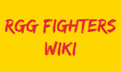

# RGG Fighters Wiki
My version of a wiki for fighters in the Like A Dragon series.

## Description
With upcoming games from Like A Dragon, I figure that I take the task to make a wiki of a subsection of the Like A Dragon Fandom Wiki, particularly for fighters/protagonists of the series.
These are characters that typically have one or more movesets that

It is true that there are multiple wikis of the characters from Like A Dragon.
However, I feel that certain aspects of it are lacking.
Most notably, those with one or more fighting styles do not really have in-depth information about them.
The current wikis that I have seen, like from Fandom, they give a basic idea of what each style has.
However, the description can be too vague, since it will never reference what each style has to offer by name.

For instance, 2 of Kazuma Kiryu's styles from 4 of the games has a heat action called __Essence Of Sumo Slapping/Grand Bruising__.
The only reason I am able to find this is because I have played the game, and saw the description from Fandom matching it:

_He can also quickly close the distance between an enemy and catch them off guard with an open handed right slap, launching them into the air.
This is followed by a left slap, left backhand slap, and final left slap that leaves the enemy on the ground. — Fandom_

A person who never played the game might not know what the description is meaning, unless the name is mentioned.

Obviously, I am not suggesting to put all eggs in one basket, which could create a cluttered mess in one post.
However, after having a brief mention of a fighting style from a character post, we will make use of another post to highlight each fighting style.

What can be described of a fighting style are as follows:
- Whether it is a main fighting style of a character
- Aura colors
- Miscellaneous
- Moveset characteristics:
  - Rush Combos
  - Grabs
  - Basic Attacks
  - Dodging, Blocking, Reversals
  - Counterattacks
  - Taunting
  - Heat Actions

Hence, I am aiming to complete a wiki-based website that help to describe such fighting characters.

## Steps
